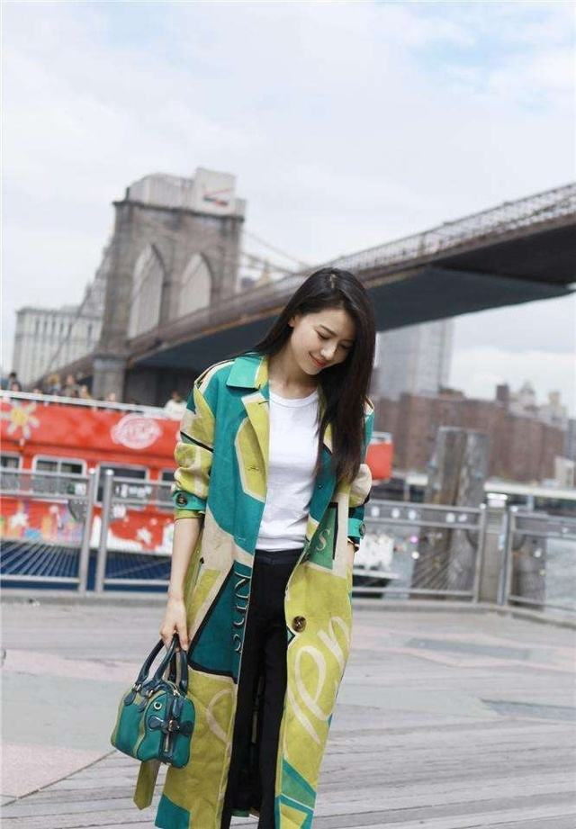

# picture-resize
我们在写HTML的时候会碰到因为图片尺寸与父容器的宽高比例不符, 而导致图片比例变形,  影响美观和体验, 我在网络上找了很多网友的方法都不能实现我想要的功能, 之后我浏览QQ空间的时候, 发现QQ空间的图片布局这是我要的效果, 意识到, 单单使用纯css样式想达到我的效果很难, 所以使用jQuery写了这个例子解决图片关于尺寸问题导致变形的问题;


```
	<body>

		<div class="post">
				
		</div>

		<div class="post">
				
		</div>
		<script type="text/javascript" src="jquery-1.7.2.min.js"></script>
		<script type="text/javascript">
					$(document).ready(function() {
						 $('.post img').each(function() {
						 var praWidth = $(this).parent().width(); // 父容器宽度
						 var praHeight = $(this).parent().height();    // 父容器的高度
						 var width = $(this).width();    // 图片实际宽度
						 var height = $(this).height();  // 图片实际高度
						 var ratio = width / height;  // 图片宽高比例
						 var toLeft = 0; // 设置左偏量
						 var toTop = 0; // 设置上偏移量
						 width = praWidth;   // 设置宽度为当前父容器宽度
						 height = width / ratio;    // 计算等比例缩放后的高度 
						if(height < praHeight) { // 如果图片高度小于父容器告高度
							height = praHeight;  // 设置图片高度为父容器高度
							width = height * ratio; // 设置图片等比缩放后的宽度
						}
						
						// 获取偏移量
						if(width > praWidth) {
							toLeft = (width - praWidth) / 2;
						} else {
							toTop = (height - praHeight) / 2;
						}
	
						// 设定等比例缩放后的宽高
						$(this).css("height", height);
						$(this).css("width", width);
						// 设定等比例缩放后的偏移量
						$(this).css("margin-left", -toLeft);
						$(this).css("margin-top", -toTop);
					 });
					 });
		
		</script>
	</body>


<style>
.post{
	margin: 0 auto;
	width: 600px;
	height: 400px;
	background: #ccc;
	overflow: hidden;
}

</style>```


